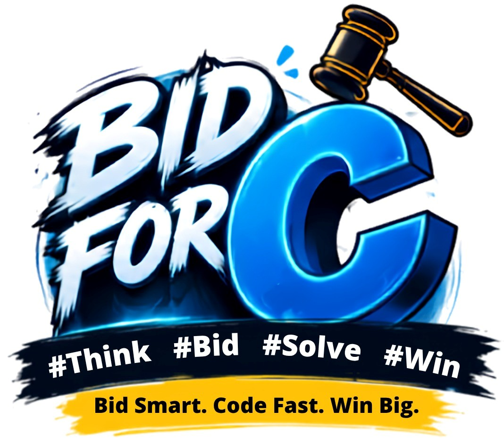

# Bid for C

Realtime LAN-based coding auction system for college events. Teams bid with coins,
winners solve challenges for reward points, all live on projector screens.



## Requirements

- Node.js 22+ (v24 recommended)
- npm

## Quick Start

```bash
cd auction-quiz
npm run install:all   # install root + server + client dependencies
npm run dev           # starts both services
```

Then open:
- Team / Admin / Displays → http://localhost:5173
- Find your LAN IP (e.g. `ipconfig`) so other devices can join via `http://<your-ip>:5173`

## Ports

| Service | Port | Notes                      |
| ------- | ---- | -------------------------- |
| Server  | 3000 | API + Socket.IO, binds LAN |
| Client  | 5173 | Vite dev server            |

## Routes

| Route                      | Description                    |
| -------------------------- | ------------------------------ |
| `/`                        | Home page                      |
| `/team`                    | Team registration + bidding    |
| `/display/live`            | Live auction projector view    |
| `/display/scores`          | Scoreboard projector view      |
| `/control-panel-7f8a9b2c`  | Admin control panel (secret)   |

## Features

### Core System
- **Realtime bidding** — Server-authoritative auctions with 800ms rate limit
- **Multi-increment bidding** — +20 (navy) and +50 (gold) bid options
- **Task system** — Winners get coding challenges with timer
- **Sound effects** — 10 sound types with per-sound enable/disable + volume control
- **Branding** — "Bid for C" branding across all screens with logo

### Bidding Mechanics
- Each team starts with coins
- Bid to win coding challenges
- Solve within time to earn rewards
- Highest reward points wins

### Admin Features
- Start/stop auctions
- Set question images
- Manual timer control (+30s)
- Sound settings (global + per-sound)
- Team management

### Sound Events
- `auction_start` / `auction_end`
- `bid_small` (+20) / `bid_big` (+50)
- `bid_win`
- `timer_start` / `timer_end`
- `pass` / `fail`
- `tick`

## Configuration

### Environment Variables (Optional)

| Variable | Default | Description |
|----------|---------|-------------|
| `PORT` | 3000 | Server port |
| `ADMIN_SECRET` | 7f8a9b2c | Admin panel secret |
| `ALLOW_REMOTE_ADMIN` | false | Allow remote admin access |

### Resetting

```bash
# Stop server, then:
npm run db:reset --prefix server
# Restart server - fresh database
```

## Sound Files

Place MP3 files in `client/public/sounds/`:
- `auction_start.mp3`
- `auction_end.mp3`
- `bid_small.mp3`
- `bid_big.mp3`
- `bid_win.mp3`
- `timer_start.mp3`
- `timer_end.mp3`
- `pass.mp3`
- `fail.mp3`
- `tick.mp3`

Upload via Admin Panel → Sound Settings

## Tech Stack

- **Server**: Node.js, Express, Socket.IO, SQLite
- **Client**: React, Vite, TypeScript
- **Design**: Custom design system with tokens

## License

College event use only.
